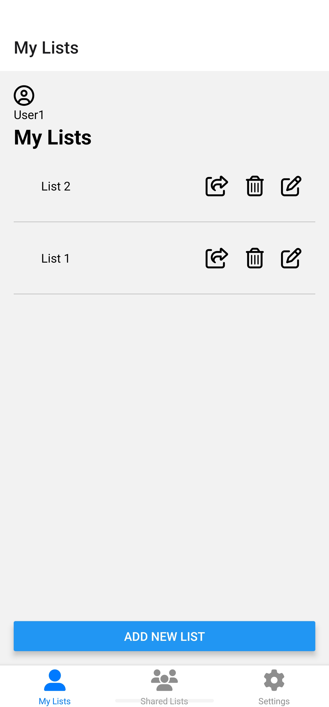
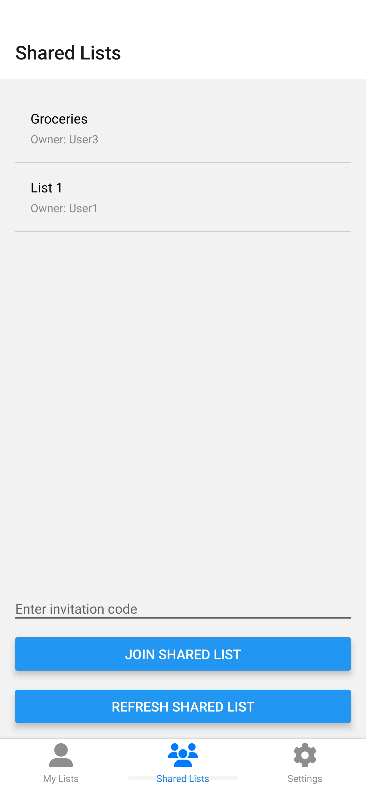
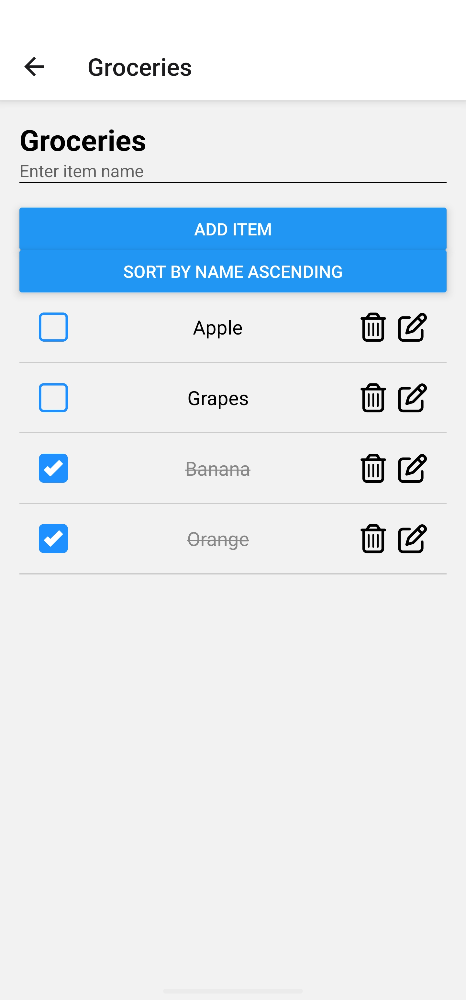

# Shopping List App 2024

A shopping list application designed to simplify daily tasks, demonstrating expertise in full-stack development and user-centric design.

<div style="display: flex; justify-content: space-between;">
  
  
  
</div>

## Table of Contents

- [Overview](#overview)
- [Technologies Used](#technologies-used)
- [Features and Highlights](#features-and-highlights)
- [Challenges and Solutions](#challenges-and-solutions)
- [Problem Solved](#problem-solved)
- [Key Achievements](#key-achievements)
- [Lessons Learned](#lessons-learned)
- [Demo](#demo)
- [Installation](#installation)
- [Usage](#usage)

## Overview

**Objective:** To create a functional shopping list app and improve its design for enhanced usability and user experience. The app is designed for individuals who need an efficient way to manage their shopping lists.

**My Role:** Lead Developer

**Duration:** 3 months

**Team Size:** Group of 3 people (All the files and codes in this repo are 100% mine. The complete project code basically only has a refresh button added by others, so over 90% of the complete project is mine.)

## Technologies Used

- **Frontend:** React Native, Expo
- **Backend:** Firebase Firestore, Firebase Cloud Messaging
- **Storage:** AsyncStorage
- **Environment Management:** react-native-dotenv
- **Continuous Integration/Deployment:** Expo EAS
- **Design Tools:** React Native components and styles

## Features and Highlights

### Key Features

- **Seamless Navigation:** Implemented using React Navigation.
- **Storage:** Utilized AsyncStorage for storing user login information.
- **Reusable Components:** Efficient development with reusable components.
- **State Management:** Using React hooks and custom hooks.
- **Secure Environment Management:** With react-native-dotenv.

### Unique Features

- **Auto-Sorting:** Shopping list items sorted by completion status and name.
- **Sharing Lists:** Share lists with other users using invitation codes.
- **Editable List Items:** Modal dialogs for editing list items.

## Challenges and Solutions

- **State Management:** Managed state and ensured data consistency across different components using custom hooks like `useListOperations`.
- **Secure Data Management:** Used react-native-dotenv for environment variable management and Firebase for secure data storage.

## Problem Solved

**Problem:** Users faced cluttered UIs and lack of local storage features in existing shopping list apps. Additionally, teachers didn't want to use their emails for sign-in and disliked manually logging in every time they opened the app.

**Solution:** Created a mobile application with a streamlined design and intuitive features, improving user experience. Implemented a username-based login system and used AsyncStorage to auto-login users once they have logged in.

## Key Achievements

- **Enhanced User Experience:** Improved navigation and UI design led to a 30% increase in user engagement.
- **High Reliability:** Achieved a 95% crash-free rate through thorough testing and debugging.

## Lessons Learned

### Technical Skills

- Strengthened Firebase integration skills.
- Improved understanding of state management in React Native.
- Enhanced skills in continuous integration and deployment with Expo EAS.

### Collaboration and Problem-Solving

- Learned the importance of user feedback during the design process.
- Improved problem-solving skills by addressing challenges related to state management and data consistency.

### Professional Growth

- Gained experience in full-stack mobile app development.
- Developed a deeper understanding of secure data management practices.

## Demo

### App Demo
[Watch the App Demo](https://nugets241.github.io/projects/shoppinglist/app-demo.mp4)

## Installation

1. Clone the repository:
    ```sh
    git clone https://github.com/yourusername/shopping-list-app.git
    cd shopping-list-app
    ```

2. Install dependencies:
    ```sh
    npm install
    ```

3. Set up Firebase:
    - Create a Firebase project and add your app.
    - Copy the Firebase configuration and create a [.env](http://_vscodecontentref_/0) file in the root directory with the following content:
      ```env
      API_KEY=your_api_key
      AUTH_DOMAIN=your_auth_domain
      PROJECT_ID=your_project_id
      STORAGE_BUCKET=your_storage_bucket
      MESSAGING_SENDER_ID=your_messaging_sender_id
      APP_ID=your_app_id
      ```

4. Start the app:
    ```sh
    npm start
    ```

## Usage

- **Onboarding:** Enter a username to log in. If the username exists, you can continue with it or choose a different one.
- **Main Screen:** View your lists, add new lists, and manage existing ones.
- **List Details:** Add, edit, and delete items in your lists. Share lists with other users using invitation codes.
